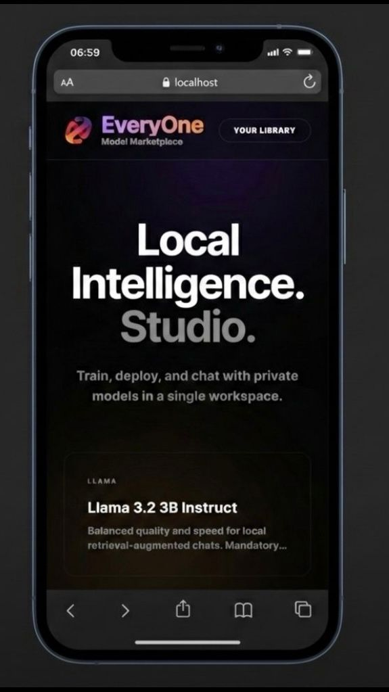

<div align="center">
  
  <br>
  <br>
</div>
# Local Intelligence for EveryOne

This project contains:
- A React/Vite frontend in `src/`
- A FastAPI backend in `backend/`
- A Serverless Fine-Tuning pipeline via Modal in `modal_app.py`

The frontend calls the local backend on `/api/*`, which handles RAG, local inference (llama.cpp), and delegates fine-tuning to the cloud (Modal).

---

## 🚀 Key Features

* **100% Local Inference**: Chat with GGUF models (Llama, Phi, Qwen, Mistral) downloaded to your machine for total privacy.
* **RAG & Drag-and-Drop**: Ingest your PDFs from the home page or drop them **directly into the chat window** to add them to the AI context in real-time.
* **1-Click Fine-Tuning**: Train your own models (LoRA -> Merge -> Q4_K_M GGUF Quantization) on Modal's cloud GPUs directly from the web interface.
* **Dynamic Management**: Download, rename, and load your fine-tuned models into memory without restarting the server.

---

## 1) Installation & Python Environment

We use a single **Python 3.10** virtual environment at the root of the project, which serves both the backend and deployment tools.

Navigate to the project root and create the virtual environment:

```bash
python3.10 -m venv .venv
```

**Activating the environment:**
* On Windows: `.\.venv\Scripts\activate`
* On Mac/Linux: `source .venv/bin/activate`

**Installing dependencies:**
While still at the project root:
```bash
pip install -r requirements.txt
```

**Starting the FastAPI backend:**
Navigate to the `backend/` folder to start the server:
```bash
cd backend
uvicorn api:app --host 127.0.0.1 --port 8000 --reload
```

> **Healthcheck**: `curl http://127.0.0.1:8000/api/health`

---

## 2) Launching the Frontend

From the project root, install Node dependencies and launch Vite:

```bash
npm install
npm run dev
```

By default, Vite configures a proxy from `/api` to `http://127.0.0.1:8000`.

---

## 3) Fine-Tuning Configuration (Modal)

To use the Fine-Tuning feature ("🚀 Fine-Tune Model"), you must configure Modal.

1. Create an account on [modal.com](https://modal.com) and authenticate your terminal:
   ```bash
   modal setup
   ```
2. Create a Modal secret containing your HuggingFace token (to download base weights):
   ```bash
   modal secret create huggingface-secret HF_TOKEN=hf_your_token_here
   ```
3. Deploy the training script to Modal servers:
   ```bash
   modal deploy backend/finetune.py
   ```
4. **Important**: Modal will return an API URL (e.g., `https://your-username--llama32-gguf-finetune...`). Copy this URL and update the `MODAL_URL` variable in the `/api/finetune` route within your `backend/api.py` file.

---

## 📁 Local Model Architecture (GGUF)

The backend automatically scans the `backend/Model/` directory to find `.gguf` models.

If you use the "⬇️ Download Finetuned" button from the Web interface, the backend will use the Modal CLI to automatically retrieve the cloud-generated `.gguf` model to this local directory with your chosen name.

Verify models recognized by the backend:
```bash
curl http://127.0.0.1:8000/api/models/local
```
The `isLoaded` field indicates if the GGUF file is currently loaded in VRAM/RAM.

---

## 📄 PDF Ingestion & RAG

- **Anti-duplication**: Previously indexed PDFs are not re-integrated, detected via SHA-256 file hashing.
- **Precision**: Chunks store the original page number (`chunks.page`), and chat sources display the page.
- **Transparency**: Chat responses explicitly display cited sources (PDF title, page number, and relevance score).

---

## 🌐 Environment Variables & Network Deployment

Copy `.env.example` to `.env` if you wish to host the backend and frontend on separate machines:

```bash
cp .env.example .env
```

If your backend is running on a different machine (e.g., IP `10.0.0.12`):

1. **Frontend (`.env`)**:
```env
VITE_BACKEND_PROXY_TARGET=http://10.0.0.12:8000
VITE_API_BASE_URL=
```

2. **Backend (same shell)**:
```bash
CORS_ORIGINS=http://localhost:5173,http://192.168.x.x:5173 uvicorn api:app --host 0.0.0.0 --port 8000
```
